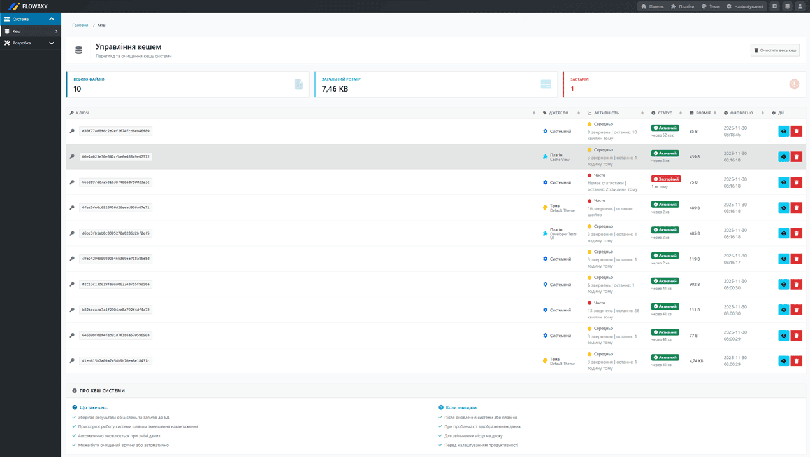

# Cache View Plugin

**Version:** 1.0.0  
**License:** Proprietary
**Developer:** iTeffa (iteffa@flowaxy.com)  
**Studio:** FLOWAXY 
**Website:** https://flowaxy.com  

## Description

Cache View plugin for Flowaxy CMS provides a user-friendly interface for viewing and managing system cache. The plugin displays cache statistics, allows viewing cache files, identifies cache sources (plugins, themes, system), checks cache expiry status, and provides tools for clearing cache.

## Screenshot



> **Note:** For the best visual experience, refer to the screenshot in the `assets/images/` directory.

## Features

### Core Features

- 📊 **Cache Statistics** — View total files count, total cache size, and expired items count
- 📁 **Cache File Listing** — Browse all cache files with detailed information
- 🔍 **Cache Source Detection** — Automatically identifies cache sources:
  - Plugin cache (shows plugin name)
  - Theme cache (shows theme name)
  - System cache (shows cache type label and category)
- 🔥 **Activity Heatmap** — Visual indicators showing cache usage frequency:
  - 🔴 **High activity** — Frequently accessed cache items
  - 🟡 **Medium activity** — Moderately used cache items
  - 🟢 **Low activity** — Rarely accessed cache items
  - Shows access count and last access time
- ⏰ **Expiry Status** — Checks if cache items are expired or active
  - Shows expiry time and remaining time for active items
  - Highlights expired items
- 👁️ **Cache Content Viewer** — View cache file content in JSON, PHP Array, or raw text format
- 🗑️ **Cache Management** — Clear entire cache or individual cache items
- 🔄 **Sortable Table** — Sort cache items by key, source, status, size, or modification date
- 📱 **Responsive Design** — Mobile-friendly interface with adaptive layouts
  - Desktop: Full table view with all details
  - Mobile: Card-based layout optimized for small screens
- ✅ **Access Control** — Permission-based access to cache management

### Technical Capabilities

- File system cache scanning
- Cache file content analysis (deserialization)
- Integration with Flowaxy CMS cache settings
- Timezone-aware cache expiry checking
- Modal dialogs for safe cache clearing

## Requirements

- PHP >= 8.4.0
- Flowaxy CMS with plugin support
- Read/write access to cache directory
- Admin access for cache management

## Installation

1. Copy the plugin directory to `plugins/cache-view/`.
2. Activate the plugin via the admin panel (Settings → Plugins).
3. The plugin will automatically register its route and menu item.

No database tables are required - the plugin works with existing cache files.

## Usage

### Accessing the Cache View Page

1. Log in to the admin panel.
2. Navigate to **System → Cache View** in the menu.
3. Or go directly to `/admin/cache-view`.

### Viewing Cache Statistics

The plugin displays three main statistics cards:

- **Total Files** — Number of cache files
- **Total Size** — Total cache size (KB or MB)
- **Expired Items** — Number of expired cache items

### Cache File Information

Each cache file shows:

- **Key** — Cache key (filename without extension)
- **Source** — Where the cache comes from:
  - Plugin name (if from a plugin)
  - Theme name (if from a theme)
  - System cache type (e.g., "Site Settings", "Admin Menu")
- **Cache Type** — Category of cache (routes, translations, configuration, user, etc.)
- **Activity** — Usage frequency indicator:
  - 🔴 **Часто** (High) — Frequently accessed (60+ score)
  - 🟡 **Середньо** (Medium) — Moderate usage (20-60 score)
  - 🟢 **Рідко** (Low) — Rarely accessed (<20 score)
  - Shows access count and last access time
- **Status** — Cache expiry status:
  - 🟢 **Active** — Cache is valid (shows remaining time)
  - 🔴 **Expired** — Cache has expired (shows time ago)
  - ⚪ **Unknown** — Cannot determine expiry status
- **Size** — File size (KB or MB)
- **Updated** — Last modification time
- **Actions** — View content and delete buttons for individual cache items

### Sorting and Filtering

- Click on column headers to sort cache items:
  - **Key** — Sort alphabetically by cache key
  - **Source** — Sort by cache source
  - **Activity** — Sort by activity level (high → low)
  - **Status** — Sort by expiry status
  - **Size** — Sort by file size
  - **Updated** — Sort by modification date
- Sort direction toggles between ascending and descending
- Visual sort indicators show current sort column and direction

### Clearing Cache

#### Clear All Cache

1. Click the **"Clear All Cache"** button in the page header.
2. Confirm the action in the modal dialog.
3. All cache files will be deleted (system files like `.gitkeep` and `.htaccess` are preserved).

**Note:** The button is disabled when cache is empty.

#### View Cache Content

1. Click the eye icon (👁️) next to any cache item.
2. The cache content will be displayed in a modal dialog.
3. View content in three formats:
   - **JSON** — Formatted JSON representation
   - **PHP Array** — PHP var_export format
   - **Raw** — Raw text content (for non-serialized data)

#### Clear Individual Cache Items

1. Click the trash icon (🗑️) next to any cache item.
2. Confirm the action in the modal dialog.
3. The selected cache file will be deleted.

### Cache Expiry Checking

The plugin checks cache expiry by:

1. Reading cache file content
2. Looking for `expires` field in serialized data
3. If `expires` is missing, calculating expiry using:
   - `created` timestamp + `cache_default_ttl` from system settings
4. Comparing with current time to determine status

Cache settings are retrieved from:
- `cache_enabled` — Whether caching is enabled
- `cache_default_ttl` — Default cache lifetime (seconds)

## Plugin Structure

```
cache-view/
├── assets/
│   ├── images/
│   │   └── screenshot.png       # Plugin screenshot
│   └── styles/
│       └── cache-view.css       # Styles for the cache view page
├── src/
│   ├── admin/
│   │   └── pages/
│   │       └── CacheViewAdminPage.php  # Admin page controller
│   └── Services/
│       └── CacheStatsTracker.php       # Cache activity tracking service
├── templates/
│   └── cache-view.php           # Cache view page template
├── tests/
│   └── CacheViewPluginTest.php  # Diagnostic tests
├── .gitignore                   # Git ignore rules
├── init.php                     # Plugin initialization
├── plugin.json                  # Plugin metadata
└── README.md                    # Documentation
```

## Technical Details

### Architecture

The plugin uses a service-oriented architecture:

- **CacheViewAdminPage** — Admin panel page for cache management
- **CacheStatsTracker** — Service for tracking cache access statistics
- **Templates** — PHP templates for HTML rendering
- **Components** — Reusable admin UI components:
  - `stats-cards.php` — Statistics cards
  - `data-table.php` — Sortable data table
  - `empty-state.php` — Empty state display
  - `info-block.php` — Information blocks
  - `modal.php` — Modal dialogs

### Cache Source Detection

The plugin determines cache source by:

1. **Key Pattern Analysis** — Checks for known prefixes:
   - `plugin_data_*` — Plugin cache
   - `theme_settings_*`, `theme_config_*`, `theme_*` — Theme cache
   - Other keys — System cache

2. **Content Analysis** — For generic hash keys:
   - Unserializes cache file content
   - Checks data structure:
     - Plugin data: Contains `id`, `slug`, `name`, `installed_at` fields
     - Theme data: Contains `slug`, `name`, `is_default`, `supports_customization` fields
     - System data: Analyzes structure to determine cache type (routes, translations, configuration, etc.)

### Cache Activity Tracking

The plugin tracks cache access to display activity heatmap:

- **Automatic Tracking** — Integrated into the core Cache class
- **Activity Score** — Calculated based on:
  - Recent 24-hour activity (60% weight)
  - Recent 7-day activity (30% weight)
  - Total access count (10% weight)
- **Activity Levels**:
  - **High** (60-100 score) — Frequently accessed
  - **Medium** (20-60 score) — Moderate usage
  - **Low** (0-20 score) — Rarely accessed
- **Statistics Storage** — Saved to `.cache-stats.json` in cache directory
- **Auto-cleanup** — Old statistics (30+ days) are automatically removed

### Cache Expiry Detection

The plugin checks cache expiry status:

1. Reads cache file and unserializes content
2. Looks for `expires` timestamp field
3. If missing, calculates: `created` + `cache_default_ttl` (from settings)
4. Compares with current time:
   - **Active** — `expires > current_time`
   - **Expired** — `expires < current_time`
   - **Unknown** — Cannot determine expiry

### Security

- ✅ CSRF protection for all write operations
- ✅ Access permission checks before executing operations
- ✅ Path traversal protection when accessing cache files
- ✅ XSS protection via output sanitization
- ✅ System file protection (`.gitkeep`, `.htaccess` are never deleted)

### Hooks

The plugin uses the following hooks:

- `admin_register_routes` — Register admin route
- `admin_menu` — Add menu item to System section
- `settings_categories` — Add plugin to settings page

### Components Used

The plugin utilizes reusable admin components:

- **Stats Cards** — For displaying statistics (total files, size, expired)
- **Data Table** — For displaying cache items with sorting
- **Empty State** — For displaying "Cache is empty" message
- **Info Block** — For displaying system cache information
- **Modal** — For confirmation dialogs

## Configuration

### Cache Settings

The plugin respects cache settings from **Site Settings** (`/admin/site-settings`):

- **Enable Caching** — Whether caching is enabled
- **Cache Default TTL** — Default cache lifetime (seconds)
- **Auto Cleanup** — Automatic cleanup of expired cache

These settings affect:
- Expiry status calculation
- Cache source detection
- Statistics display

### Default Behavior

By default, the plugin:
- Shows all cache files from the cache directory
- Filters out system files (`.gitkeep`, `.htaccess`)
- Displays cache statistics
- Allows clearing cache (if user has permissions)
- Sorts cache items by modification date (newest first)

## Development

### Dependencies

The plugin uses the following components from the Engine:

- `engine/core/support/base/BasePlugin.php`
- `engine/interface/admin-ui/includes/AdminPage.php`
- `engine/core/support/helpers/UrlHelper.php`
- `engine/core/support/helpers/SecurityHelper.php`
- `engine/core/support/managers/SettingsManager.php` (for cache settings)
- `engine/core/support/managers/PluginManager.php` (for plugin name resolution)
- `engine/core/support/managers/ThemeManager.php` (for theme name resolution)

### Extending Functionality

To extend the plugin:

1. **Add new cache source types** — Modify `detectCacheSource()` method in `CacheViewAdminPage.php`
2. **Add new statistics** — Extend `getCacheInfo()` method and update template
3. **Customize expiry checking** — Modify `checkCacheExpiry()` method
4. **Add filtering options** — Extend template with filter UI and update `getCacheInfo()`
5. **Customize UI** — Edit `templates/cache-view.php` and `assets/styles/cache-view.css`

### Cache Directory

The plugin reads from the cache directory defined by:

1. `CACHE_DIR` constant (if defined)
2. `ROOT_DIR . '/storage/cache'` (default)
3. Fallback to `dirname(__DIR__, 5) . '/storage/cache'`

**Important:** The plugin only reads cache files and never modifies them directly. Cache clearing operations use the Cache API or file system operations with proper access controls.

## Troubleshooting

### Common Issues

**Cache not appearing:**
- Verify cache directory permissions (read access required)
- Check if cache is enabled in Site Settings
- Ensure cache files have `.cache` extension

**Cannot clear cache:**
- Verify user has `admin.cache.clear` permission
- Check cache directory write permissions
- Ensure system files (`.gitkeep`, `.htaccess`) are not missing

**Expiry status showing as "Unknown":**
- Verify cache files are properly serialized
- Check `cache_default_ttl` setting in Site Settings
- Ensure cache files have valid `created` or `expires` fields

### Getting Help

If you find a bug or have questions:

1. Check log files for errors (`storage/logs/`)
2. Verify cache directory permissions
3. Ensure cache files are readable
4. Check system cache settings in Site Settings (`/admin/site-settings`)
5. Review the diagnostic tests output

## Testing

### Diagnostic Tests

The plugin includes a set of diagnostic tests to verify functionality. Tests are located in the `tests/` directory:

- **CacheViewPluginTest.php** — Set of automatic tests to verify:
  - Getting cache info with empty cache
  - Getting cache info with files
  - Cache source detection (system cache)
  - Cache expiry checking (active and expired)
  - Getting cache settings from database
  - Time formatting (time ago and time left)
  - Clear cache button creation (enabled and disabled states)

Tests are automatically loaded through Flowaxy CMS `TestService` and `TestRunner` system.

### Running Tests

To run the diagnostic tests:

```bash
php engine/application/testing/cli/run-tests.php --plugin=cache-view
```

Or use the Flowaxy CMS test runner:

```bash
php flowaxy test --plugin=cache-view
```

### Quick Cache Test

You can test cache functionality manually by:

1. Creating test cache files manually
2. Checking if they appear in the cache view
3. Verifying expiry status
4. Testing cache clearing functionality

## License

Proprietary. All rights reserved.

## Changelog

### 1.0.0 (2025-11-30)

**Initial Release**

- ✨ Initial release
- ✅ Cache file listing and statistics
- ✅ Cache source detection (plugin, theme, system)
- ✅ Cache expiry status checking
- ✅ Cache clearing (all or individual items)
- ✅ Sortable table with column sorting
- ✅ Responsive design (desktop and mobile)
- ✅ Modal dialogs for confirmations
- ✅ Integration with Flowaxy CMS Engine
- ✅ Reusable admin UI components
- ✅ Empty state handling
- ✅ Disabled button when cache is empty
- ✅ Cache activity tracking and heatmap
- ✅ Cache content viewer (JSON, PHP Array, Raw)
- ✅ Cache type categorization
- ✅ Diagnostic tests
- ✅ CSRF protection
- ✅ Permission-based access control

## Author

**FlowAxy**  
Developer: iTeffa  
Email: iteffa@flowaxy.com  
Studio: FLOWAXY  
Website: https://flowaxy.com

## License

Proprietary. All rights reserved.

---

*Developed with ❤️ for Flowaxy CMS*

